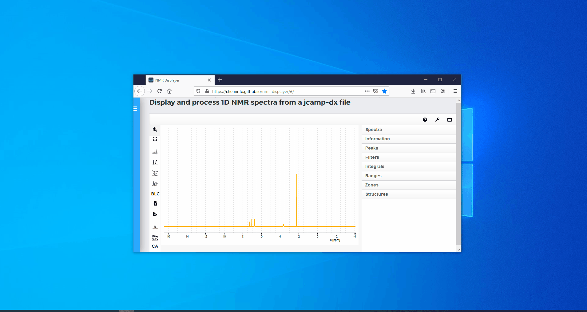

#### Full screen mode

Haga click en el botón de "Full screen" para abrir el modo pantalla completa.
#### Click the "full Screen button" to open the full screen mode.

#### Exit full screen mode

Para salir del modo pantalla completa, presione ESC en el teclado. Otra posibilidad para salir del modo de pantalla completa es presionar el boton derecho del mouse. Una nueva pequeña ventana aparecerá en la cual debe hacer click en "Exit full screen" con el botón izquiedo del mouse.
#### To exit the full screen mode,  press ESC on the keyboard. Another possibility to exit the full screen mode is to press the right mouse button. A new, small window appears in which "Exit full screen" must be clicked with the left mouse button.
