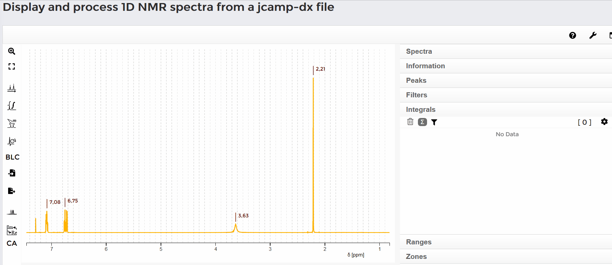
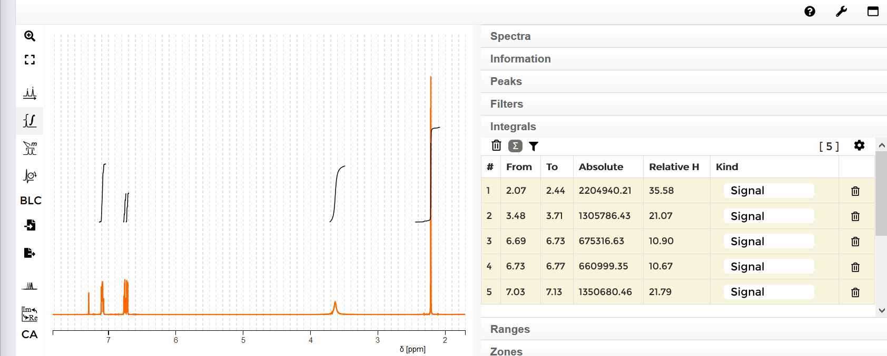
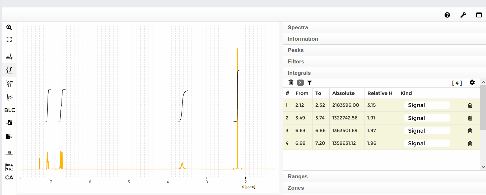
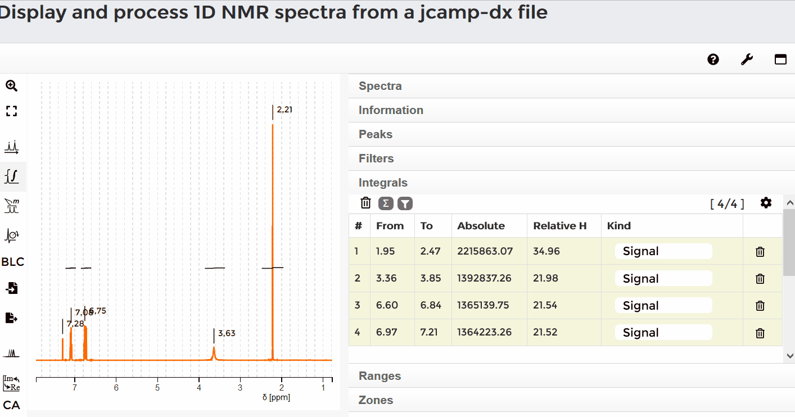

#### Automatic integration

Puede marcar una señal apretando la tecla shift mientras presiona el botón izquierdo del mouse y mueve el mouse sobre el rango de la señal. Luego de soltar ambas teclas aparecerá la integral de la señal. En el lado derecho de la pantalla, bajo la pestaña "Integrals" se crará una lista de integrales. Si mueve el mouse sobre el desplazamiento químico de la integral en el espectro, la entrada correspondiente será mostrada en la lista. Si mueve el mouse sobre cierta línea en la lista, la integral correspondiente se marcará en el espectro. 
#### You mark a signal by simultaneously holding down the shift key and the left mouse button and moving the mouse over the range of the signal. After releasing both keys, the integral of the signal appears. On the right side of the screen, under the "Integrals" tab, a list of all integrals is listed. If you move the mouse over the shift of the integral in the spectrum, the corresponding entry is displayed in the list. If you move the mouse over a certain line in the list, the corresponding integral in the spectrum is marked.

#### Delete all integrals

Para borra todas las integrales mueva el mouse a la lista "Integrals" y presione el botón de la papelera en el lado iquierdo de la lista. Aparecerá un cuadro rojo. Haga clieck en "yes" y todas las integrales serán borradas.
#### To delete all integrals move the mouse to the list "Integrals" and press the trash button on the left side above the list. A red box apears. Click "yes". All integrals are deleted.

#### Delete a single integral

Para borrar una integral mueva el mouse a la lista y seleccione una integral. Presione el botón de papelera en el lado derecho de la linea de la señal. La integral será borrada.
#### To delete one integral move the mouse to the list and select a integral. Press the trash button on the rigth side of the line of the signal. The integral is deleted.

Un modo alternativo de borrar una única integral es mover el mouse sobre una integral en el espectro Un circulo rojo aparecerá. Haga click en el círculo y la integral será borrada.
#### An alternativ way to delete a single integral is to move the mouse over a integral in the spectrum. A red ring appears. Click this red ring, the integral is deleted.

#### Change integral sum

Por defecto la suma de todoos los protones integrados es 100. Para cambiar esta suma, haga click el símbolo de sumatoria. Aparecerá un cuadro gris. Ingrese el número total de protones integrados y haga click en "set". En la lista en el lado derecho, se indicará el número relativo de protones para la integral respectiva. 
#### The default sum of all integrated protons is 100. To change this sum, click on the sum symbol. A grey box appears. Enter the total number of integrated protons and click "Set".  In the list on the right side, the relative number of protons for the respective integral is indicated.

