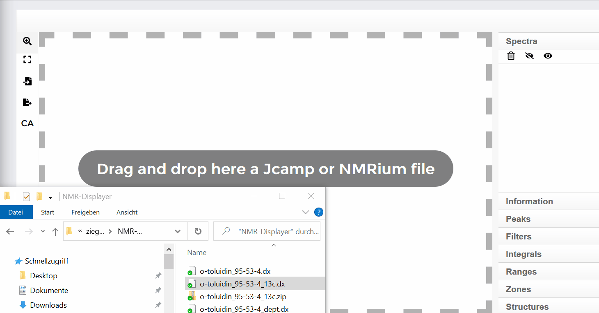
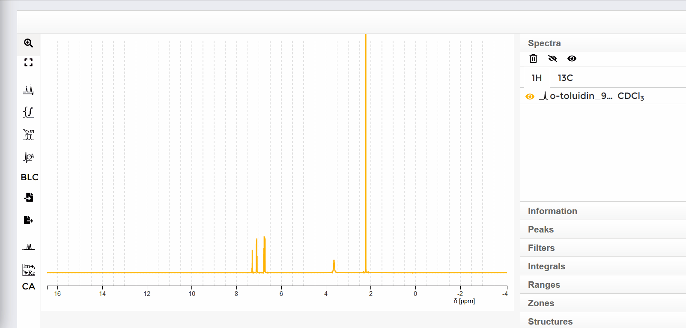

#### Open a spectrum

Para abrir un espectro, arrastre o copie y pegue desde la pc al espacio de trabajo un archivo jcamp o NMRium con datos crudos de RMN. Para hacer eseto, los archivos jcamp correspondientes deben ser seleccionados en el explorador de archivos y arrastrado al espacio de trabajo mientras presiona el botón izquierdo del mouse. 
#### To open a spectrum, the Jcamp or NMRium file with the raw data must be dragged or copied and pasted from the computer into the workspace. To do this, the corresponding jcamp files are selected in the Explorer and dragged into the workspace with the left mouse button held down.

De forma alternativa, puede abrir el link hacia un archivo jcamp. En el lado izquierdo del espacio de trabajo hay una barra con botones. Haciendo click en el tercer botón desde arriba y haciendo click en el texto "Add jcamp from URL" se abrirá una peequeña ventana. En esta ventana puede insertar el link hacia el archivo correspondiente o tipearlo usando el teclado. Haciendo click en el botón "Load" se abrirá el espectro.
#### Alternatively the link to a jcamp file can be opened. On the left side of the workspace there is a bar with buttons. By clicking the third button from above and then clicking the text "Add jcamp from URL" a small window opens. In this window you can either insert the link to the corresponding file or enter it using the keyboard. Clicking the "Load" button in the small window opens the spectrum

#### switch between spectra 

Puede cambiar entre espectros de 1H y 13C haciendo click en el icono correspondiente. El espectro Dept eestá ubicado bajo el botón de 13C.
#### You can switch between 1H and 13C spectra by clicking the corresponding icon. The Dept spectrum is located under the 13C button.

