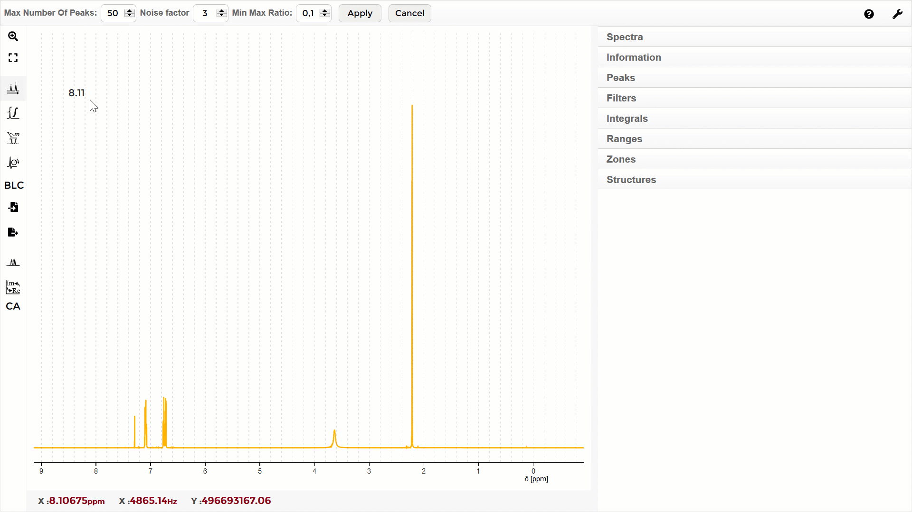
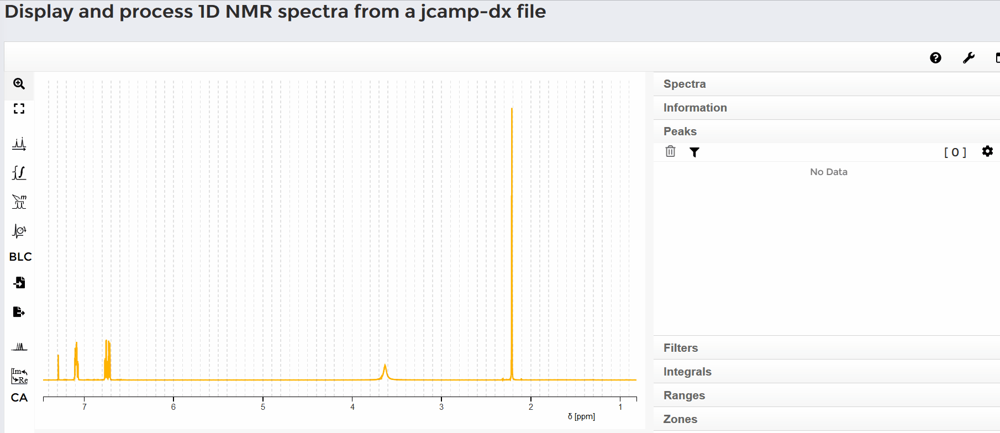
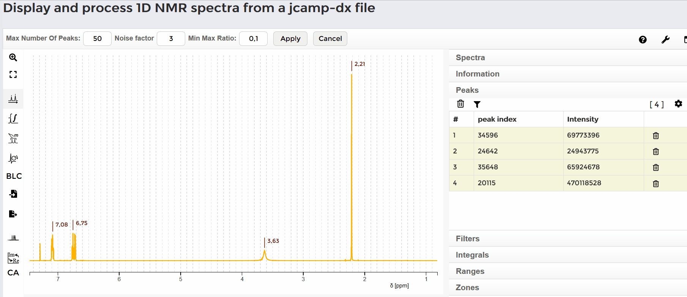
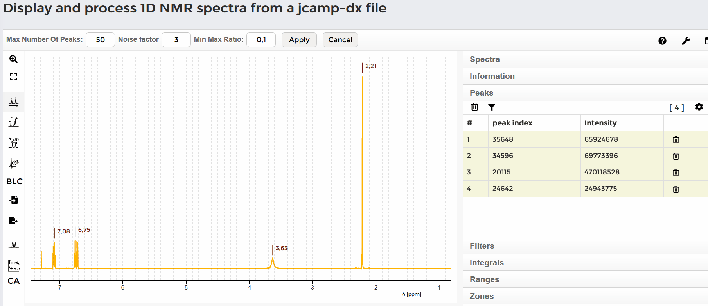

#### Select a single signal

Para seleccionar una sola señal, haga click en el botón "peaks pickinf". Mueva el mouse sobre la señal y haga click en ella con el botón izquierdo del mouse. El desplazamiento del pico aparecerá sobre la señal. El valor exacto de la señal puede ser encontrado en la tabla del lado derecho de la interfase bajo la pestaña "peaks". 
#### To select a single signal, click the "peaks picking" button. Move the mouse to the selected signal and click on it with the left mouse button. The peak shift appears over the signal. The exact value of the signal can be found in a table on the right side of the interface under the "peaks" tab.

#### Automatic single peak picking

Puede marcar una señal apretando simultaneamente la tecla "shift" y el botón izquierdo del mouse sobre el rango de la señal. Luego de soltar ambas teclas aparecerá el desplazamiento químico de la señal. En el lado derecho de la pantalla, bajo la pestaña "Peaks" se listan todas las señales seleccionadas. Si mueve el mouse sobre el desplazamiento químico de la señal en el espectro, la linea correspondiente es marcada en la lista. Una señal es listada para el rango que fue marcado con el mouse: El rango es almacenado como un multiplete que deberá ser mas precisamente analziado con la función "range peaking". Si mueve el mouse sobre una cierta linea en la lista, el correspondiente desplazamiento químico es marcado en el espectro. 
#### You mark a signal by simultaneously holding down the shift key and the left mouse button and moving the mouse over the range of the signal. After releasing both keys, the shift of the signal appears. On the right side of the screen, under the "Peaks" tab, a list of all selected signals is listed. If you move the mouse over the shift of the signal in the spectrum, the corresponding entry is displayed in the list. A signal is listed for the range that has been marked with the mouse: The range is stored as a multiplet, which has to be analyzed more precisely with "range peaking". If you move the mouse over a certain line in the list, the corresponding shift in the spectrum is marked.

#### Delete all peaks

Para borrar todas las señales mueva el mouse a la lisa de picos (pestaña "peaks") y presiones el botón de la papelera en el lado izquierdo arriba de la lista. Aparecerá un cuadro rojo, haga click en "yes". Todas las señales serán borradas.
#### To delete all signals move the mouse to the list "Peaks" and press the trash button on the left side above the list. A red box apears. Click "yes". All signals are deleted.

#### Delete a single peak

Para borrar una señal mueva el mouse a la lista y seleccione la señal. Presione el botón de la papelera en el lado derecho de la linea de la señal. El pico será borrado.
#### To delete one signal move the mouse to the list and select a signal. Press the trash button on the rigth side of the line of the signal. The peak is deleted.

Una forma alternativa es mover el mouse sobre una señal del espectro. Un anillo rojo aparecerá. Haga click en este anillo y el pico será borrado.
#### An alternativ way is to move the mouse over a signal in the spectrum. A red ring appears. Click this red ring, the peak is deleted.

